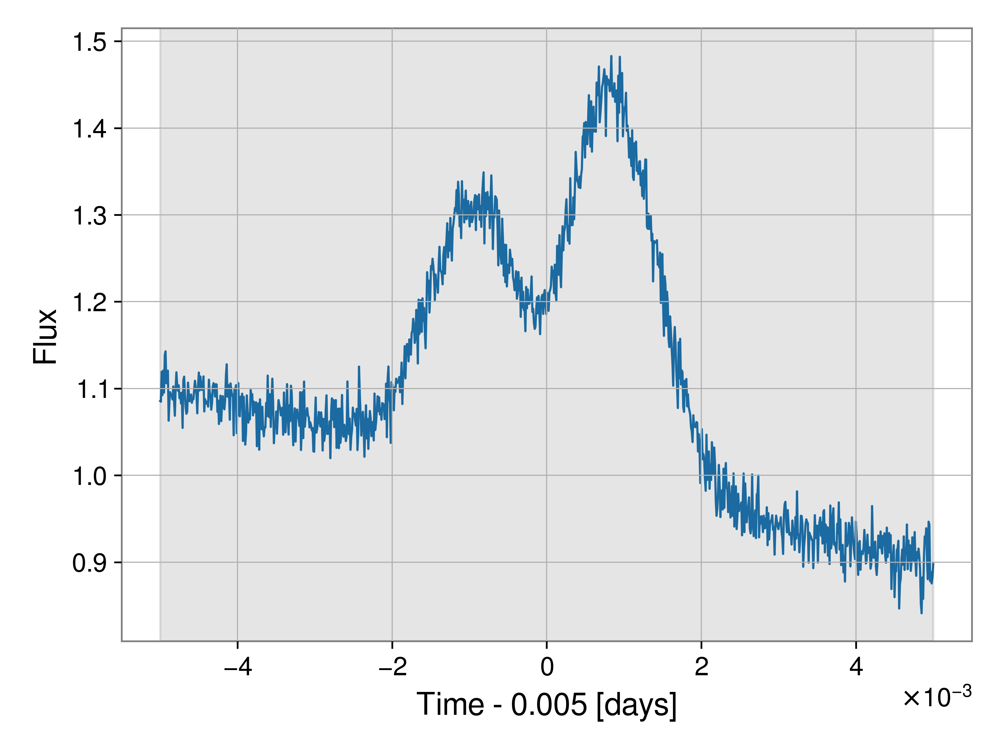
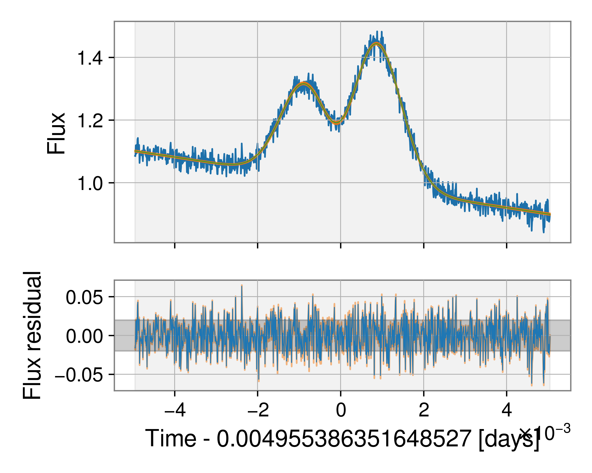

Single pulse analysis
=====================

Kookaburra provides a command-line tool for fitting single pulses. To get help
with this, run

.. code-block:: console

   $ kb_single_pulse --help

This takes a single positional argument, the data to analyse, and a number of
optional arguments related to the choice of model to fit and priors. We provide
a quick-start example on simulated data below.

Quick start
-----------

To demonstrate the basic input and output, we will create simulated data from
a pulsar (flux as a function of time) and analyse it. First, we run the script
:code:`make_fake_data.py` available in the examples directory. Here are the
contents:

.. literalinclude:: ../../examples/make_fake_data.py

This will create a file :code:`fake_data.txt`.

Now we can run :code:`kb_single_pulse` on this data file.

.. code-block:: console

   $ kb_single_pulse fake_data.txt -p 0 -s 5 -b 2 --plot-fit

The flag :code:`-p` sets the pulse number to extract from the data file. For
this example simulated data only a pulse 0 exists, but in general a data file
could contain many pulses. The flag :code:`-s` sets the number of shapelets
to use in the fit. When simulating the data, the model had 3 shapelets. Here,
we set a maximum number of 5. The flag :code:`-b` sets the order of the base
polynomial. Here we chose a first order polynomial. If you do not need to
remove a baseline, set :code:`-b 0`. Finally, we include flags to plot the data
(this will be done before the main analysis begins) and the fit to the data.

Here is the figure of the data itself, the gray band indicates the prior range
(in this case, the whole data span).

Here is the figure of the fit to the data. The green line indicates the maximum
likelihood fit, while the orange band indicates the 90% model uncertainty
around this fit. The lower plot illustrates the residual after subtracting the
maximum likelihood model while the orange shaded region again indicates the
uncertainty in the residual.

The code outputs all results to :code:`outdir/` by default (this can be changed
with a command-line argument). The result itself is the :code:`.json` file, this
is a bilby json file, but with extra information stored such as the residual.
