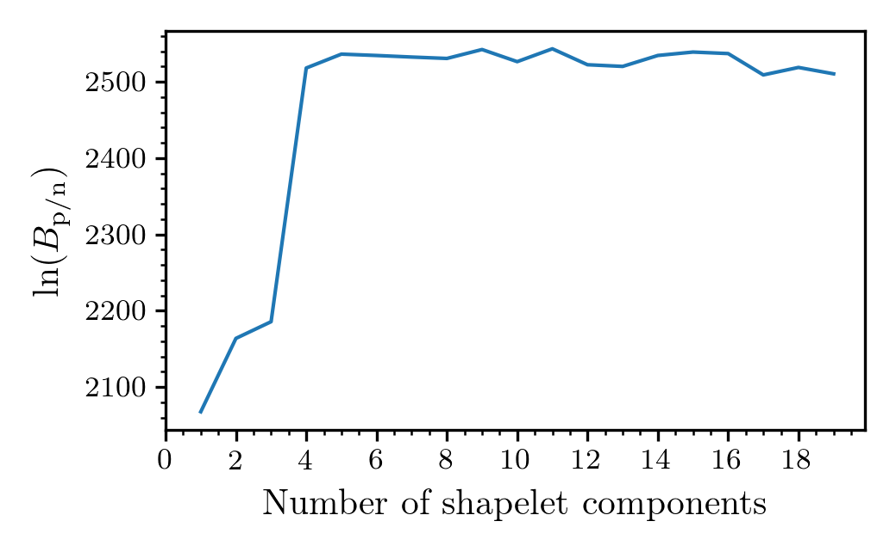

# Summary

Radio pulsars are rapidly-spinning highly-magnetized neutron stars which
produce a lighthouse-like beam of radiation. This radiation is observed by
radio telescopes as periodic pulsations. Kookaburra provides a method to fit
flux models to individual pulsations, building on the notion of profile-domain
time (see, e,g @lentati:2014, @lentati:2015). Fitting is performed by stochastic
sampling methods building on the bilby [@bilby:2019] Bayesian inference
library. An executable, `kb_single_pulse` provides the primary interface, but
more complicated models can be fit using the underlying python API.

# Flux model

The primary flux model provided by kookaburra is a simplified version of the
shapelet model proposed in @refregier:2003. We define shapelets as

$$ f(t) = \sum_{i=0}^{n_s} C_{i} H_{i}(t/\beta) e^{-t^2 / \beta^2} \,, $$

where $C_{i}$ are the shapelet coefficients, $H_{i}$ is the Hermite polynomial
of degree $i$, and $\beta$ is a width parameter. The complete single-component
shapelet flux model fit to the data is then $f(t - \tau)$ where $\tau$ is the
pulse time of arrival. Kookaburra provides the option to fit multiple additive
shapelet flux models at the same time with a prior on the time of arrival
uniformly distributed between the components.

In addition to the pulse itself, radio-pulsar data often contains a background
flux. We model this by a polynomial base-flux model of arbitrary degree with
reference time centred to the middle of the observation. The complete flux
model used in fitting can, therefore, be expressed as

\begin{equation}\label{eqn:full_flux}
F(t) = \sum_{i=0}^{n_p} B_{i}(t - t_{mid})^{i} + \sum_{j=0}^{n_m} f(t - \tau)\,
\end{equation}

where $n_p$ is the degree of the base polynomial and $n_m$ is the number of
shapelet models (each having an independent number of shapelet components
$n_s$). This flux model is implemented in the executable `kb_single_pulse`.
Generalisations can be made by using the underlying python API and extending
the set of flux models in `kookaburra.flux`.

# Null and Pulse models

In analysing a set of data, we can estimate the probability of a null by
running an analysis excluding the components of the flux model intended to model
the pulsation itself. Using the polynomial base flux, our null model is

\begin{equation}\label{eqn:null_flux}
F(t) = \sum_{i=0}^{n_p} B_{i}(t - t_{mid})^{i}
\end{equation}

Fitting \autoref{eqn:full_flux} and \autoref{eqn:null_flux}, the difference
in log-evidences obtained from each constitues a Bayes factor $B_{\rm p/n}$
quantifying the probability the data contains a pulsation vs. a null.

# Slab-spike priors

The flux-model coefficients, $C_i$ determine the contribution of each term in
the shapelet model to the overall flux. We implement a so-called slab-spike
prior (see, e.g. @malsiner:2018). This a mixture-model prior given by

$$ \pi(C_i) = \left\{ \begin{array}{cc} \xi & \textrm{ if } C_i = \hat{C}_i \\ (1-\xi)\pi'(C_i)  & \textrm{otherwise} \end{array}\right.\,, $$

where $\xi$ determines the mixing fraction between the spike $\hat{C}_i$ and
the slab $\pi'(C_i)$. We then choose the spike to be at zero (i.e. the
contribution from the $i^{\rm th}$ component is zero) and the slab to be
a uniform distribution. The slab-spike prior greatly improves the performance of
the stochastic sampling algorithm as it can 'turn off' components which
do not improves the fit to the data.

# Maximum number of components

The optimal (in the sense of maximising the Bayesian model evidence) number of
shapelet models $n_m$, the number of components for each model $n_s$, and the
degree of the base polynomial $b_p$ is unknown for any data set (except in the
case of simulated data). This means we have uncertainty about the
model-space dimensionality. Typical stochastic sampling algorithms require a
fixed-dimensional space to satisfy their underlying assumptions and ensure the
results are a proper reflection of the posterior distribution and evidence.
Reversible-jump MCMC (RJMCMC) methods [@green:1995] enable trans-dimensional
sampling and a posterior estimate of the dimensionality and the components of
each dimension, marginalized over the full uncertainty. However, RJMCMC methods
typically require specialised implementations for the problem in hand.  When
faced with an unknown model dimensionality, a cheap and effective alternative
to implementing an RJMCMC sampler is to run identical analyses, but varying the
model dimensionality. For kookaburra, we find that setting a sufficiently
large number of components (determined experimentally) combined with the
slab-spike priors results in an efficient sampling of high-dimensional spaces.
The maximum number of components will depend on the analysis at hand, in the
literature, values as large as 30 are typical [@lentati:2017].

To demonstrate the behaviour of kookaburra with a varying number of components,
we create a simulated data set based on the profile of PSR J0835-4510, also
known as the Vela pulsar (see, e.g. @palfreyman:2016). In
\autoref{fig:bayes_factor}, we plot $B_{\rm p/n}$, the pulse vs. null Bayes
factor as a function of the number of components.  This demonstrates that below
six components, vast improvements in the fit are achieved by the addition of
extra components. Above six, modest improvements are made as more subtle
features get fit. Eventually, the Bayes factor will turn over and start to
decrease as additional components fail to improve the fit, but incur extra
losses from the Occam factor [@mackay:2003]. In \autoref{fig:fit}, we show the
output of kookaburra, for the 19-component model fit to the simulated data.

# Validation

To validate that the kookaburra implementation is unbiased, we simulate 100
pulses with a 10-component shapelet and polynomial base-flux of degree 2. We
run kookaburra on each simulated data set then, in \autoref{fig:pp}, we plot a
parameter-parameter (PP) plot [@cook:2006] using these posteriors calculated
for these 100 simulated data sets. The plot demonstrates that each of the model
parameters fit produces a diagonal line on the PP-plot, i.e. the X\% confidence
interval (C.I.) contains the true simulated value X\% of the time (to within
the statistical uncertainties). 

# Outlook

The kookaburra software provides an easy-to-use interface for shapelet
modelling of radio pulsar profiles. Many extensions could
be implemented in future, such as frequency-dependent shapelet models,
alternative fitting algorithms such as maximum-likelihood methods.

# Acknowledgements

kookaburra builds on an extensive software stack and the authors appreciate the
efforts of the community to build a vibrant ecosystem which makes work such as
this possible. kookaburra uses `scipy` [@scipy:2020], `numpy` [@oliphant:2006],
and `pandas` [@pandas:2010; @pandas:2020] for data handling and manipulation;
`matplotlib` [@hunter:2007] for visualisation; `bilby` [@bilby:2019] for Bayesian
inference-related aspects. All results in this work were generated using the
`pymultinest` sampler [@buchner:2014].

# References
