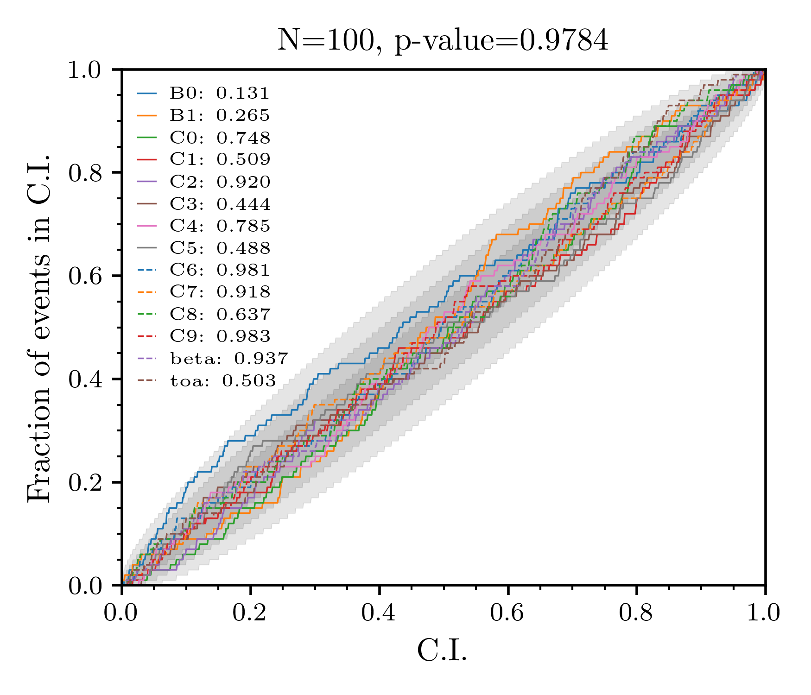

# Summary

Radio pulsars are rapidly-spinning highly-magnetized neutron stars which
produce a lighthouse-like beam of raditation. This radiation is observed by
radio telescopes as periodic pulsations. Kookaburra provides a method to fit
flux models to individual pulsations. Fitting is performed by stochastic
sampling methods building on the bilby [@bilby:2019] Bayesian inference
library. An executable, `kb_single_pulse` provides the primary interface, but
more complicated models can be fit using the underlying python API.

# Flux model

The primary flux model provided by kookaburra is a simplified version of the
shapelet model proposed in @refregier:2003. We define shapelets as

$$ f(t) = \sum_{i=0}^{n_s} C_{i} H_{i}(t/\beta) e^{-t^2 / \beta^2} \,, $$

where $C_{i}$ are the shapelet coefficients, $H_{i}$ is the Hermite polynomial
of degree $i$, and $\beta$ is a width parameter. The complete single-component
shaplet flux model fit to the data is then $f(t - \tau)$ where $\tau$ is the
pulse time of arrival. Kookaburra provides the option to fit multiple additive
shaplet flux models at the same time with a prior on the time of arrival
uniformly distributed between the components.

In addition to the pulse itself, radio-pulsar data often contains a background
flux. We model this by a polynomial base-flux model of arbitrary degree with
reference time centered to the middle of the observation. The complete flux
model used in fitting can therefore be expressed as

$$ F(t) = \sum_{i=0}^{n_p} B_{i}(t - t_{mid})^{i} + \sum_{j=0}^{n_m} f(t - \tau)\, $$

where $n_p$ is the degree of the base polynomial and $n_m$ is the number of
shapelet models (each having an independent number of shapelet components
$n_s$). This flux model is implemented in the executable `kb_single_pulse`.
Generalisations can be made by using the underlying python API and extending
the set of flux models in `kookaburra.flux`.

# Slab-spike priors

The flux-model coefficients, $C_i$ determine the contribution of each term in
the shapelet model to the overall flux. We implement a so-called slab-spike
prior (see, e.g. @malsiner:2018). This a mixture-model prior given by

$$ \pi(C_i) = \left\{ \begin{array}{cc} \xi & \textrm{ if } C_i = \hat{C}_i \\ (1-\xi)\pi'(C_i)  & \textrm{otherwise} \end{array}\right.\,, $$

where $\xi$ determines the mixing fraction between the spike $\hat{C}_i$ and
the slab $\pi'(C_i)$. We then choose the spike to be at zero (i.e. the
contribution from the $i^{\rm th}$ component is zero) and the slab to be
uniform distribution. The slab-spike prior greatly improves the performance of
the stochastic sampling algorithm as it is able to 'turn off' components which
do not improves the fit to the data.

The optimal (in the sense of maximising the Bayesian model evidence) number of
shapelet models $n_m$, the number of components for each model $n_s$, and the
degree of the base polynomial $b_p$ is unknown for any data set (except in the
trivial case of simulated data). This means we have intrinsic undercertainty
about the model-space dimensionality. Typical stochastic sampling algorithms
require a fixed-dimensional space to satisfy their underlying assumptions and
ensure the results are a proper reflection of the posterior distribution and
evidence. Reversible-jump MCMC (RJMCMC) methods [@green:1995] are used with significant
success in the literature, but typically require specialised implementations
for the problem in hand.

When faced with an unknown model dimensionality, a cheap and effective
alternative to implementing an RJMCMC sampler is to run identical analyses, but
varying the model dimensionality. We demonstrate the typical behaviour of such
an analysis below. A common pitfall of this approach is that 

A graphical figure of the Bayesian log evidence
for each dimension is usually sufficient to indicate either the optimal number
of dimensions (by chosing the maximum evidence) or a minimum value 

# Validation

